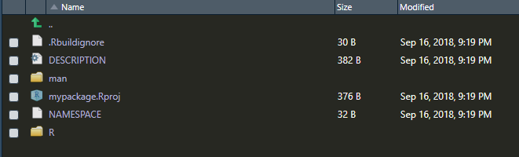

================
devtools package
================

R package development has become substantially easier in recent years with the introduction of a package by Hadley Wickham called devtools. As the package name suggests, this includes a variety of functions that facilitate software development in R.

Hands down, the best resource for mastering the devtools package is the book R Packages by Hadley Wickham. The full book is available online for free at https://r-pkgs.org/. It is also available as a hard copy book published by O'Reilly. If you plan to develop a lot of R packages, it is well worth your time to read this book closely.

Here are some of the key functions included in devtools and what they do, roughly in the order you are likely to use them as you develop an R package:

.. list-table:: Useful **devtools** functions
   :widths: 25 55
   :header-rows: 1

   * - Function
     - Use

   * - **bash**
     - Open bash shell in package directory 
   * - **create**
     - Create a package 
   * - **load_all**
     - Load the code for all functions in the package, roughly simulates what happens when a package is installed and loaded with ``library()``
   * - **document**
     - Create ``man`` documentation files and the “NAMESPACE” file from roxygen2 code
   * - **use_readme_rmd**
     - Set up the package to include a README file in Rmarkdown format
   * - **use_build_ignore**
     - Specify files that should be ignored when building the R package (for example, if you have a folder where you’re drafting a journal article about the package, you can include all related files in a folder that you set to be ignored during the package build)
   * - **check**
     - Check the full R package for any ERRORs, WARNINGs, or NOTEs
   * - **check_win_devel**
     - Check package on the development version of R.
   * - **check_win_release**
     - Check package on the release version of R. Once building is complete you'll receive a link to the built package in the email address listed in the maintainer field.
   * - **check_win_oldrelease**
     - Check package on the previous major release version of R.
   * - **submit_cran**
     - Submit the package to CRAN
   * - **build_site**
     - Generates the static HTML documentation for the package
   * - **build_readme**
     - Locates ``README.Rmd`` and builds it into a ``README.md``
   * - **install_github**
     - Install package from GitHub repository
   * - **install_gitlab**
     - Install package from Gitlab repository 
   * - **install_bitbucket**
     - Install package from Bitbucket repository      
   * - **test_coverage**
     - Computes test coverage for your package

Some of these functions you'll only need to use once for a package. The one-time (per package) functions are mostly those that set up a certain type of infrastructure for the package. For example, if you want to use R Markdown to create a README file for a package you are posting to GitHub, you can create the proper infrastructure with the ``use_readme_rmd`` function. This function adds a starter README file in the main directory of the package with the name "README.Rmd". You can edit this file and render it to Markdown to provide GitHub users more information about your package. However, you will have problems with your CRAN checks if there is a README file in this top-level directory of the package, so the ``use_readme_rmd`` function also adds the files names for the R Markdown README file, and the Markdown file it creates, in the ".Rbuildignore" file, so it is not included when the package is built.

Creating a package
******************

The earliest infrastructure function you will use from the devtools package is create i.e. ``devtools::create()``. This function inputs the filepath for the directory where you would like to create the package and creates the initial package structure (as a note, this directory should not yet exist). You will then add the elements (code, data, etc.) for the package within this structure. As an alternative to create, you can also initialize an R package in RStudio by selecting ``"File" -> "New Project" -> "New Direction" -> "R Package"``.

In addition to starting a package using create or by creating a new project in RStudio, you could also create the package by hand, creating and then filling a directory. However, it's hard to think of any circumstances where there would be a good reason to do that rather than using some of the more convenient tools offered by devtools and RStudio.

Figure below gives an example of what the new package directory will look like after you create an initial package structure with create or via the RStudio "New Project" interface. This initial package directory includes an R subdirectory, where you will save R scripts with all code defining R functions for the package. It also includes two files that will store metadata and interface information about your package (DESCRIPTION and NAMESPACE), as well as an R project file (.Rproj extension) that saves some project options for the directory. Finally, the initial package structure includes two files that can be used to exclude some files in the directory from either being followed by git ``(.gitignore)`` or included when the package is built ``(.Rbuildignore)``. These two files have names that start with a dot, so they may not be listed if you look at the package directory structure in a file manager like "Finder" on Macs. These "dot-files" will, however, be listed in the "Files" tab that shows up in one of the RStudio panes when you open an R project like a package directory, as shown in this figure.

Other functions in devtools
***************************

In contrast to the devtools infrastructure functions that you will only use once per package, there are other devtools functions you'll use many times as you develop a package. Two of the work horses of devtools are ``load_all`` and ``document``. The ``load_all`` function loads the entire package (by default, based on the current working directory, although you can also give the filepath to load a directory elsewhere). In addition to loading all R functions, **it also loads all package data and compiles and connects C, C++, and FORTRAN** code in the package. As you add to a package, you can use load_all to ensure you're using the latest version of all package functions and data. The ``document`` function rewrites the help files and NAMESPACE file based on the latest version of the **roxygen2 comments included with each function** (writing roxygen2 is covered in more detail in the next section).

RStudio has created a very helpful Package Development Cheatsheet that covers many of the devtools functions. A pdf of this cheatsheet is `available here <https://www.rstudio.com/wp-content/uploads/2015/06/devtools-cheatsheet.pdf>`_.

  
